<div align="center">


# pdf-html

**Early-stage geometry-first PDF → HTML converter for text-based PDFs — verbatim text, source typography, zero images.**

[](https://www.python.org/)
[](https://pymupdf.readthedocs.io/)
[](#-license)
[](#-testing)
[](#)
[](#-design-principles)

*One command in. One elegant, dependency-free HTML file out.*

</div>

---

## 🎯 What it does

`pdf-html` is an **early-stage, geometry-first PDF-to-HTML converter** for **text-based PDFs**. It rebuilds the document as a **single self-contained HTML5 file** that mirrors the source document's look and structure:

- ✅ Best for: text-based PDFs with real text layers, headings, lists, tables, and multi-column layouts
- ⚠️ Not a universal OCR-first converter: scanned/image-heavy PDFs still need an OCR pre-pass or a dedicated workflow

- 🏷️ **Heading hierarchy** — font-size tiers become real `<h1>`–`<h6>`
- 🎨 **Typography & color** — the page CSS is derived from the document's own fonts, sizes, and palette
- 📊 **Tables** — ruled tables are rebuilt as real `<table>` elements, including lists *inside* cells and rows that continue across page breaks
- 📝 **Lists** — bullets and numbered items become nested `<ul>`/`<ol>` (indent decides nesting)
- 🧭 **Reading order** — multi-column layouts are re-linearized column by column
- ✂️ **Page furniture** — repeated running headers/footers and page numbers are stripped
- 🔒 **Text is verbatim** — never summarized, reworded, or reordered within a block
- 🚫 **No images, ever** — image content is dropped by design; text alone carries the document

## ⚡ Quick start

```bash
# install (Python 3.10+)
uv pip install .        # or: pip install .

# convert
pdf-html report.pdf -o report.html

# open report.html in any browser — no external assets needed
```

## 🖥️ CLI reference

```bash
pdf-html INPUT.pdf -o out.html [--extractor pymupdf|pdftotext]
    [--style auto|default] [--paginate] [--no-tables] [--no-callouts]
    [--keep-headers] [--allow-scanned]
```

| Flag | Default | What it does |
|---|---|---|
| `-o, --output` | *(required)* | Path of the HTML file to write |
| `--extractor` | `pymupdf` | Text extraction backend (`pdftotext` fallback planned) |
| `--style` | `auto` | `auto` derives CSS from the document's own fonts/sizes/colors; `default` uses a clean built-in theme |
| `--paginate` | off | Wrap each PDF page in a `<section class="sheet">` |
| `--no-tables` | off | Disable table reconstruction (table text flows as paragraphs) |
| `--keep-headers` | off | Keep repeated running headers/footers |
| `--allow-scanned` | off | Convert scanned/image PDFs instead of exiting with an OCR hint |

## 🏗️ Architecture

A deterministic pipeline — every stage is a small, pure, individually testable module:

```mermaid
---
config:
  layout: elk
  theme: neutral
---
flowchart LR
    subgraph S1["📥 1 · Extract"]
        direction TB
        PDF@{ shape: doc, label: "📄 PDF" }
        EX@{ shape: rect, label: "Extractor<br/>spans + font metadata" }
        PDF --> EX
    end
    subgraph S2["🧹 2 · Clean &amp; Profile"]
        direction TB
        HF@{ shape: rect, label: "Header/Footer<br/>stripping" }
        SP@{ shape: hex, label: "Style Profiler<br/>body size · h1–h6 · palette" }
        HF --> SP
    end
    subgraph S3["🧭 3 · Layout"]
        direction TB
        RO@{ shape: rect, label: "Reading Order<br/>column clustering" }
        TR@{ shape: fr-rect, label: "Table Reconstructor<br/>per-cell pipeline" }
    end
    subgraph S4["🏗️ 4 · Structure"]
        direction TB
        SD@{ shape: div-rect, label: "Structure Detector<br/>headings · paragraphs · lists" }
        LP@{ shape: rect, label: "List Parser<br/>nested ul/ol" }
        AST@{ shape: bow-rect, label: "AST<br/>Document → Page → Blocks" }
        SD --> LP --> AST
    end
    subgraph S5["🎨 5 · Render"]
        direction TB
        RN@{ shape: rect, label: "Renderer<br/>semantic HTML5 + inline CSS" }
        OUT@{ shape: tag-doc, label: "🌐 out.html" }
        RN --> OUT
    end
    EX --> HF
    SP --> RO
    SP --> TR
    RO --> SD
    TR --> SD
    AST --> RN
```

<details>
<summary>🔍 <b>Pipeline diagram</b> — click to enlarge (click again to close) · <a href="https://mermaid.live/view#pako:eNqNlV9vmzAUxb_KFQ97WVnzp1nbbKq2No3ykDYIMqnS2IOxL8GqsZExa7uq330GQgismZIHJzb28Tm_XJtXhyqGzhQc13VDSZWM-WYaSgBBXlRhpoDiseyaBFOcgsTCaCJCWU2PhXqiCdEGln45CSAvoo0mWQLB8GfohAW7GDPbUpzAEMJiMIjO4fbZSlATOr_qNeWHcY3UcCVhfd2OerP5t1fIE5LZrZmiJ9ZVhGIK-9L0rJwXOvDWLrx9aNeVwnsLt7sr_TXSp1d5RmQOHyFW0kCKhjBiSFfLioPrXlnNegwl62cdNVnRtiy-hFGT9UYgkfCBpNkX8LSKucAjci_mB-0vkDDUp3OlDG4jGM2zjMtN13bgtRoJPu9JBOZFYOOm1ogUe4Gc_8HGdzIMi9FgOE4-NyMZEWgMdjdZ1GgC7yCacQcNMhg3gsuqwI6g4a8O0vAtDZscVpptk1AlilQCFUVuAf1DZe23WrF2e3JrElkyPtpjYKkWuyrJULsUhYCMZyi43KPwTuSzJjK1bczOwyLGQQxnTfCgki70MZUQzPYOAP_dN7yTghka3PlNaix5-99pUpnbjQiem7yLZukdxLy0s8EjOt9ClmjhMijEqRJdke_BulWJ1FPfsH1eKcwULVK0Z86W2fByZMU32Py-Foo-9swFs6rQll71ZVUO0p906JMLmDSZfTsb9TEFd_-fgis1mpOHKZGGU1is75YTe4twWRYH3ARB1_3qxx4VQzbuO3dZZXc4AHsmPiUm7XH176vgVqgX_PaherCY192gBuSvOt319nb2V_VxndXdtd_pWqr14nvnBJwUdUo4s6-GV6e6_MuXxPb6d97e_gLHTOOG">open full screen ↗</a></summary>
<br/>



</details>

| Module | Responsibility |
|---|---|
| `extractor.py` | `TextExtractor` ABC; PyMuPDF backend reads per-span size/weight/color/bbox and detects table regions |
| `header_footer.py` | Strips spans repeating on ≥ 60% of pages in the top/bottom 10% bands |
| `style_profiler.py` | Character-weighted font-size histogram → body size, heading tiers, color palette |
| `reading_order.py` | Column detection via x-gap clustering, with a card-grid fallback and straddle guard |
| `table_reconstructor.py` | Assigns spans to detected cells, runs the full pipeline *inside each cell*, merges cross-page rows |
| `structure.py` | Classifies lines into headings/paragraphs/list items from geometry + font cues |
| `list_parser.py` | Indent-based nesting; glyph style only picks `ul` vs `ol`; markers stripped, text verbatim |
| `ast.py` | Typed document model — `Document → Page → Block`, runs carry inline style |
| `renderer.py` | Single-file HTML5 with one `<style>` block and CSS variables from the profile |

## 📊 Table reconstruction highlights

The hardest part of PDF → HTML is tables. `pdf-html`:

1. 🔍 Detects ruled tables geometrically (PyMuPDF `find_tables()`) at extraction time
2. 📌 Assigns the page's *styled* spans to cells by bounding box — inline bold/color/size survive
3. 🔄 Runs the normal line → paragraph → list pipeline **inside every cell**, so bullets in cells become real nested lists
4. 🧵 Merges rows that continue across page breaks (empty-first-cell fragments) back into one row — even resuming mid-list-item
5. 🏷️ Promotes a bold-only first row to a `<th>` header row

## 🧭 Design principles

| Principle | Meaning |
|---|---|
| 🧮 **Pure geometry, no AI** | All structure is inferred from font metadata and bounding boxes. No NLP, no LLM, no document-specific regexes |
| 🔒 **Text is sacred** | Output text is verbatim; only `& < >` are escaped |
| 🚫 **No images** | Spans overlapping image rects are dropped; `` is never emitted |
| 🪂 **Graceful degradation** | Heuristic failures only affect styling — never text content or order |
| 🔧 **Tunable & testable** | Every heuristic threshold is a named module-level constant with focused unit tests |

## ⚖️ How it compares

Every PDF converter picks a trade-off. `pdf-html` optimizes for **semantic, reflowable, styled HTML with a verbatim-text guarantee** — a square none of the established tools occupy:

| Tool | Output | Semantic structure | Keeps typography | Deterministic | Footprint |
|---|---|:---:|:---:|:---:|---|
| **pdf-html** | Self-contained HTML5 | ✅ `h1–h6`, `ul/ol`, `table` | ✅ CSS derived from the source | ✅ | ~30 MB (PyMuPDF only) |
| [pdf2htmlEX](https://github.com/pdf2htmlEX/pdf2htmlEX) | Pixel-faithful HTML | ❌ positioned glyphs | ✅ visually | ✅ | C++ toolchain |
| [Poppler pdftohtml](https://poppler.freedesktop.org/) | Positioned divs / bare text | ❌ | ⚠️ partial | ✅ | system package |
| [pymupdf4llm](https://pypi.org/project/pymupdf4llm/) | Markdown for LLM ingestion | ⚠️ headings & lists | ❌ discarded | ✅ | ~30 MB |
| [marker-pdf](https://pypi.org/project/marker-pdf/) | Markdown/JSON via ML | ✅ | ❌ discarded | ❌ model-dependent | GB-scale models, GPU-friendly |
| [docling](https://pypi.org/project/docling/) | Markdown/HTML/JSON via ML | ✅ | ❌ discarded | ❌ model-dependent | GB-scale models |
| [unstructured](https://pypi.org/project/unstructured/) | Element JSON for RAG | ⚠️ element types | ❌ | ⚠️ | heavy optional deps |
| Adobe PDF Services | Structured JSON/HTML | ✅ | ⚠️ | ❌ | cloud API, paid |

**When to choose pdf-html** — you want a *readable, reflowable* document that still looks like the original, produced offline, reproducibly, with text you can trust character-for-character (text-based PDFs, tables included, even across page breaks).

**When to choose something else** — you need pixel-perfect visual replicas (pdf2htmlEX), OCR-heavy scanned document conversion (marker, docling), or RAG-oriented element JSON (unstructured).

## 🧪 Testing

56 tests cover every pipeline stage plus end-to-end CLI runs over deterministic fixture PDFs
(report, two-column paper, slide deck, brochure, ruled table):

```bash
uv sync                                        # dev deps (pytest, reportlab)
uv run pytest                                  # run the suite
uv run python tests/fixtures/make_fixtures.py  # regenerate fixture PDFs
```

Verbatim-ness is asserted mechanically: every source string drawn into a fixture must appear in the rendered HTML.

## 📁 Project structure

```
pdf-html/
├── src/pdf_html/
│   ├── cli.py                  # argparse CLI → pipeline → HTML
│   ├── extractor.py            # PyMuPDF span + table-region extraction
│   ├── header_footer.py        # repeated page-furniture stripping
│   ├── style_profiler.py       # font-size histogram → style profile
│   ├── reading_order.py        # column clustering & span ordering
│   ├── table_reconstructor.py  # cell assignment, per-cell pipeline, row merging
│   ├── structure.py            # heading / paragraph / list classification
│   ├── list_parser.py          # nested list folding
│   ├── ast.py                  # typed document model
│   └── renderer.py             # semantic HTML5 + derived CSS
├── tests/                      # 56 tests + deterministic PDF fixtures
├── README.md
└── TUTORIAL.md                 # step-by-step usage guide
```

## 🛣️ Roadmap

- [x] Ruled-table reconstruction with cross-page row merging
- [x] Column-aware reading order with card-grid detection
- [x] Repeated header/footer stripping
- [ ] Borderless-table detection (whitespace-gap heuristic)
- [ ] Callout/aside detection (`--no-callouts` flag already reserved)
- [ ] Dependency-free `pdftotext` fallback extractor
- [ ] `colspan`/`rowspan` from merged-cell geometry

## 🤝 Contributing

Contributions welcome! Ground rules:

- 🐍 Python 3.10+, type hints throughout
- 📦 PyMuPDF is the **only** hard runtime dependency
- 🧩 Keep heuristics small, pure, and individually testable; thresholds as named constants
- ✅ One feature per commit (`feat|fix|docs|refactor|chore: ...`); update README/TUTORIAL with any user-facing change
- 🧪 `uv run pytest` must stay green — fixtures are the contract

## 🚀 Releases

This project is intentionally published as an **early-stage v0.x** tool: the core pipeline is solid for text-based PDFs, but it is not a universal PDF converter for scanned pages, forms, or OCR-heavy corpora.

```bash
# 1. bump version in pyproject.toml
uv build        # 2. artifacts land in dist/
uv publish      # 3. push to PyPI (or twine upload dist/*)
```

## 📄 License

MIT — see [pyproject.toml](pyproject.toml).

---

<div align="center">

**Built with 🐍 + 📐 — early-stage geometry over guesswork.**

*If this project helped you, consider giving it a ⭐!*

</div>
